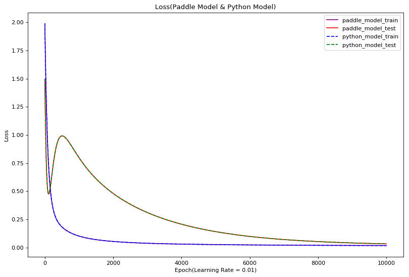
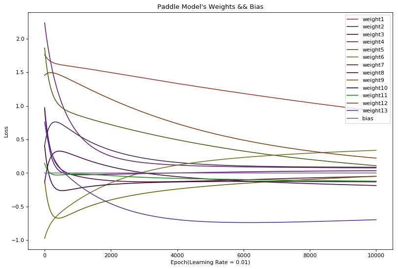
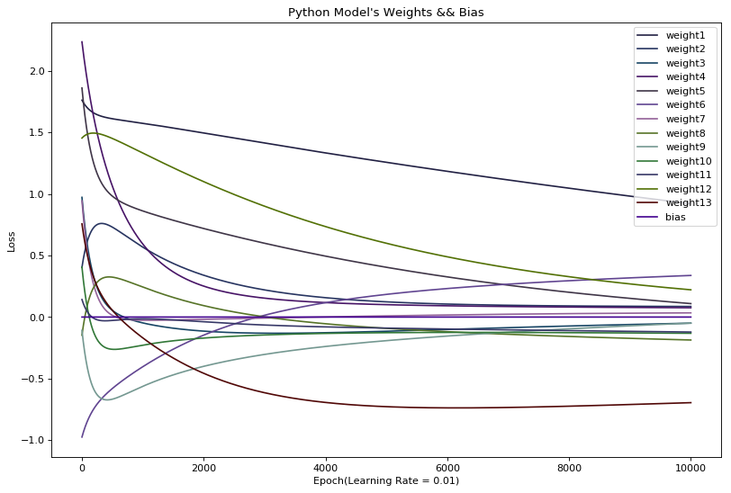

# 引言
在上一个项目《[一文帮你理解用Paddle训练模型的原理1-手写回归模型](https://aistudio.baidu.com/aistudio/projectdetail/367090)》中，我们详细的介绍了了如何使用逻辑回归算法在“波士顿房价数据集”上进行房价预测。并且，为了帮助大家深入了解机器学习的原理，我们分别通过“使用Paddle框架”和“用python根据公式手写”两种方式实现了这个只有一个神经元的单层感知机。通过实验，我们发现这两种方式编写的模型都能够很好的收敛，并在测试集数据上得到了印证。但是，在实验过程中我们也发现一个问题：**每次训练时loss的值的下降过程都是不同的**。按理说，我们采用相同的算法、使用相同的数据运行程序怎么会每次得到不同的结果呢？本项目的目的就是通过将模型训练过程中的参数进行“可视化”来帮助大家仔细的研究模型到底在训练的每一步究竟得到了怎样的运行结果。并且，在进行项目的过程中我会向大家介绍一款模型调试神器——VisualDL。尤其是里面的折线图组件（scalar）和立体直方图组件（histogram）真是在模型训练是好用的“不要不要的”（德云社的语气）。

***VisualDL简介***

VisualDL是百度PaddlePaddle和Echart团队联合推出的深度学习可视化工具，方便我们观察模型的输入输出、网络权重、训练过程等关键信息，有助于更好的理解模型的行为，加快debug进度。在[github](https://github.com/PaddlePaddle/VisualDL)开源<br>
其主要支持的可视化数据类型有：
- Scalar <br>
针对一个变量生成折线图，可以观察训练中loss趋势
<div align=center>  </img> </div>

- Histogram <br>
针对一些变量生成直方图，可以观察训练中模型权重的变化情况
<div align=center>  </img> </div>
  

# 一、 数据读取与模型设计

本项目是在上一个项目《[一文帮你理解用Paddle训练模型的原理1-手写回归模型](https://aistudio.baidu.com/aistudio/projectdetail/367090)》的基础上帮助大家进一步深入准确的分析模型的执行过程的，所以本项目的“数据读取”与“模型设计（包括使用Paddle和直接用python手写两种方式）”部分与上一项目完全相同。这里直接考妣过来。如果有小伙伴对这一部分代码有不太理解的地方，请在继续向下进行之前先回顾一下上一个项目《[一文帮你理解用Paddle训练模型的原理1-手写回归模型](https://aistudio.baidu.com/aistudio/projectdetail/367090)》。


```python
#--------------------------------------数据读取--------------------------------------
'''
数据集共506行,每行14列。前13列用来描述房屋的各种信息，最后一列为该类房屋价格中位数。
为了便于理解，而且数据量不大，此处我们并未划分batch，直接用全部数据训练。
数据集划分为训练集404条，测试集102条。
'''
import numpy as np

def load_data():
    # 从文件导入数据
    datafile = './work/housing.data'
    data = np.fromfile(datafile, sep=' ')

    # 每条数据包括14项，其中前面13项是影响因素，第14项是相应的房屋价格中位数
    feature_names = [ 'CRIM', 'ZN', 'INDUS', 'CHAS', 'NOX', 'RM', 'AGE', \
                      'DIS', 'RAD', 'TAX', 'PTRATIO', 'B', 'LSTAT', 'MEDV' ]
    feature_num = len(feature_names)

    # 将原始数据进行Reshape，变成[N, 14]这样的形状
    data = data.reshape([data.shape[0] // feature_num, feature_num])

    # 将原数据集拆分成训练集和测试集
    # 这里使用80%的数据做训练，20%的数据做测试
    # 测试集和训练集必须是没有交集的
    ratio = 0.8
    offset = int(data.shape[0] * ratio)
    training_data = data[:offset]

    # 计算train数据集的最大值，最小值，平均值
    maximums, minimums, avgs = training_data.max(axis=0), training_data.min(axis=0), \
                                 training_data.sum(axis=0) / training_data.shape[0]

    # 对数据进行归一化处理，能使模型训练更快更好的收敛
    for i in range(feature_num):
        #print(maximums[i], minimums[i], avgs[i])
        data[:, i] = (data[:, i] - avgs[i]) / (maximums[i] - minimums[i])

    # 按比例划分训练集和测试集
    training_data = data[:offset]
    test_data = data[offset:]
    return training_data, test_data

training_data, test_data = load_data()
print('训练集数据：{}条'.format(len(training_data)))
print('测试集数据：{}条'.format(len(test_data)))
print('训练数据（前三条）：')
print(training_data[:3])


#--------------------------------------使用Paddle框架编写的回归模型--------------------------------------
import paddle.fluid as fluid
from paddle.fluid.dygraph import FC
#from paddle.fluid.dygraph import Linear

class Network(fluid.dygraph.Layer):
    def __init__(self, name_scope):
        super(Network, self).__init__(name_scope)
        name_scope = self.full_name()
        
        #声明一个全连接层
        self.fc = FC(name_scope, size=1, act=None)
        #self.fc = Linear(13, 1)

    def forward(self, inputs):
        #进行前项计算并返回预测结果
        pred = self.fc(inputs)
        return pred


#--------------------------------------用python根据公式手写模型--------------------------------------
class NetworkPython(object):
    def __init__(self, num_of_weights):
        # 随机产生w的初始值
        # 为了保持程序每次运行结果的一致性，此处设置固定的随机数种子
        np.random.seed(0)
        self.w = self.w = np.random.randn(num_of_weights, 1).astype('float32')
        self.b = 0.

    #前向计算    
    def forward(self, house_features):
        pred = np.dot(house_features, self.w) + self.b
        return pred
    
    #求预测结果pred与标签label之间的均方误差作为代价函数loss
    def loss(self, house_features, label):
        error = house_features - label
        num_samples = error.shape[0]
        cost = error * error
        cost = np.sum(cost) / num_samples
        return cost
    
    #根据前向计算结果pred与标签label分别计算w的梯度和b的梯度
    def gradient(self, house_features, label):
        pred = self.forward(house_features)
        gradient_w = (pred - label)*house_features
        gradient_w = np.mean(gradient_w, axis=0)
        gradient_w = gradient_w[:, np.newaxis]
        gradient_b = (pred - label)
        gradient_b = np.mean(gradient_b)        
        return gradient_w, gradient_b
    
    #根据输入的学习率和当前梯度值更新权重向量w与偏置b
    def update(self, gradient_w, gradient_b, eta = 0.001):
        eta = eta * 2
        self.w = self.w - eta * gradient_w
        self.b = self.b - eta * gradient_b
```

    训练集数据：404条
    测试集数据：102条
    训练数据（前三条）：
    [[-0.02146321  0.03767327 -0.28552309 -0.08663366  0.01289726  0.04634817
       0.00795597 -0.00765794 -0.25172191 -0.11881188 -0.29002528  0.0519112
      -0.17590923 -0.00390539]
     [-0.02122729 -0.14232673 -0.09655922 -0.08663366 -0.12907805  0.0168406
       0.14904763  0.0721009  -0.20824365 -0.23154675 -0.02406783  0.0519112
      -0.06111894 -0.05723872]
     [-0.02122751 -0.14232673 -0.09655922 -0.08663366 -0.12907805  0.1632288
      -0.03426854  0.0721009  -0.20824365 -0.23154675 -0.02406783  0.03943037
      -0.20212336  0.23387239]]


# 二、初始化模型并进行训练
这两种方式实现的模型在训练的过程中，我们给它们的权重向量weight和偏置bias进行相同的初始化。
* 在python版的模型中我们通过设定numpy库的随机函数的种子参数，来保证每次进行相同的初始化。
```
def __init__(self, num_of_weights):
    # 随机产生w的初始值
    # 为了保持程序每次运行结果的一致性，此处设置固定的随机数种子
    np.random.seed(0)
    self.w = self.w = np.random.randn(num_of_weights, 1).astype('float32')
    self.b = 0.

```
* 为了将Paddle版本的模型进行与python版模型相同的初始化操作，我们通过Paddle的fc对象的weight.set_value()函数和bias.set_value()函数实现
```
#利用前面定义的模型类声明模型对象【利用手写模型定义model对象】
model_paddle = Network("Network")
model_python = NetworkPython(FEATURE_NUM) #此处需要设置权重向量的维度是13。
model_paddle(house_features_train_paddletype) #利用输入数据进行前向计算,为了初始化权重w和偏置b
model_paddle.fc.weight.set_value(model_python.w)
model_paddle.fc.bias.set_value(np.array(model_python.b).reshape((1)).astype('float32'))
```


```python
#使用Paddle和手写两种模型进行训练对比
import paddle.fluid.dygraph as dygraph

#设置超参数
EPOCH_NUM = 10000 #训练轮数
LEARNING_RATE = 0.01 #学习率
FEATURE_NUM = 13 #特征个数

#定义分别存储Paddle和python模型的训练信息的多维数组, 先存Paddle编写的模型的信息，后存python编写模型的信息
train_test_loss = np.empty([2,2,EPOCH_NUM], dtype = float) #用二维数组分别存储两种模型的train_loss、test_loss
model_weights_bias = np.empty([2,EPOCH_NUM,FEATURE_NUM + 1], dtype = float) #存储两种模型的weights和bias

with fluid.dygraph.guard():
    #准备数据(训练集)
    training_data, test_data = load_data()
    house_features_train = np.array(training_data[:, :-1]).astype('float32') #获得输入数据
    prices_train = np.array(training_data[:, -1:]).astype('float32') #获得标签数据
    house_features_train_paddletype = dygraph.to_variable(house_features_train) #将数据转换为Paddle框架能够读取的类型
    prices_train_paddletype = dygraph.to_variable(prices_train) #将数据转换为Paddle框架能够读取的类型
    #准备数据(测试集)
    house_features_test = np.array(test_data[:, :-1]).astype('float32') #获得输入数据
    prices_test = np.array(test_data[:, -1:]).astype('float32') #获得标签数据
    house_features_test_paddletype = dygraph.to_variable(house_features_test) #将数据转换为Paddle框架能够读取的类型
    prices_test_paddletype = dygraph.to_variable(prices_test) #将数据转换为Paddle框架能够读取的类型

    #利用前面定义的模型类声明模型对象【利用手写模型定义model对象】
    model_paddle = Network("Network")
    model_python = NetworkPython(FEATURE_NUM) #此处需要设置权重向量的维度是13。因为输入数据（影响房价的因素）是13维
    model_paddle(house_features_train_paddletype) #利用输入数据进行前向计算,为了初始化model_Paddle的权重w和偏置b
    model_paddle.fc.weight.set_value(model_python.w) #将手写模型的w赋给Paddle编写模型的权重weight
    model_paddle.fc.bias.set_value(np.array(model_python.b).reshape((1)).astype('float32')) #将手写模型的b赋给
                                                                                        #Paddle编写模型的偏置bias

    #设置Paddle模型的优化器为SGD（随机梯度下降）
    #由于我们并未划分batch所以此处采用SGD的效果其实是BGD的效果。
    opt = fluid.optimizer.SGD(learning_rate=LEARNING_RATE)

    #开始训练
    for epoch_id in range(EPOCH_NUM):
        #使用Paddle框架编写的模型进行训练
        pred = model_paddle(house_features_train_paddletype) #利用输入数据进行前向计算
        loss = fluid.layers.square_error_cost(pred, label=prices_train_paddletype) #计算loss
        avg_loss = fluid.layers.mean(loss) #求loss均值

        pred_test = model_paddle(house_features_test_paddletype) #利用输入的test数据集进行正向计算
        loss_test = fluid.layers.square_error_cost(pred_test, label=prices_test_paddletype) #计算test数据集loss
        avg_loss_test = fluid.layers.mean(loss_test) #求test数据集loss均值

        avg_loss.backward() #反向计算梯度
        opt.minimize(avg_loss) #利用梯度通过优化器函数更新网络权值。
        model_paddle.clear_gradients() #清空本次迭代优化时计算的梯度值，以准备下一次迭代优化。
        
        #保存Paddle框架编写的模型的训练loss和模型权重
        train_test_loss[0][0][epoch_id] = avg_loss.numpy()[0]
        train_test_loss[0][1][epoch_id] = avg_loss_test.numpy()[0]
        model_weights_bias[0][epoch_id] = np.concatenate((model_paddle.fc.weight.numpy().reshape(-1), model_paddle.fc.bias.numpy()))
        if(epoch_id == EPOCH_NUM - 1):
            print('[paddle_model] weight&bias: ', model_weights_bias[0][epoch_id])
        if(epoch_id % (EPOCH_NUM / 10) == 0):
            print('[paddle_model] epoch_id = {},   loss = {},   loss_test = {}'.format(epoch_id, train_test_loss[0][0][epoch_id], train_test_loss[0][1][epoch_id]))

        #使用通过python根据公式手写的模型进行训练
        pred = model_python.forward(house_features_train) #前向计算
        loss = model_python.loss(pred, prices_train) #计算loss。得到的loss已经做求均值处理。

        pred_test = model_python.forward(house_features_test) #前向计算
        loss_test = model_python.loss(pred_test, prices_test) #计算loss。得到的loss已经做求均值处理。

        gradient_w, gradient_b = model_python.gradient(house_features_train, prices_train) #分别计算得到权重
                                                                                           #向量w和偏置b的梯度
        model_python.update(gradient_w, gradient_b, LEARNING_RATE) #利用梯度值更新权重向量w和偏置b
        
        #保存通过python根据公式手写的模型的训练loss和模型权重
        train_test_loss[1][0][epoch_id] = loss
        train_test_loss[1][1][epoch_id] = loss_test
        model_weights_bias[1][epoch_id] = np.concatenate((model_python.w.reshape(-1), model_python.b.reshape(1)))
        if(epoch_id == EPOCH_NUM - 1):
            print('[python_model] w&b: ', model_weights_bias[1][epoch_id])
        if(epoch_id % (EPOCH_NUM / 10) == 0):
            print('[python_model] epoch_id = {},   loss = {},   loss_test = {}'.format(epoch_id, train_test_loss[1][0][epoch_id], train_test_loss[1][1][epoch_id]))

```

    [paddle_model] epoch_id = 0,   loss = 1.9894521236419678,   loss_test = 1.4959330558776855
    [python_model] epoch_id = 0,   loss = 1.9894520976755878,   loss_test = 1.4959330839269303
    [paddle_model] epoch_id = 1000,   loss = 0.10156026482582092,   loss_test = 0.7983884811401367
    [python_model] epoch_id = 1000,   loss = 0.10156025272784847,   loss_test = 0.7983884624406403
    [paddle_model] epoch_id = 2000,   loss = 0.053527019917964935,   loss_test = 0.4801061749458313
    [python_model] epoch_id = 2000,   loss = 0.05352701999173306,   loss_test = 0.4801061667648016
    [paddle_model] epoch_id = 3000,   loss = 0.03766000643372536,   loss_test = 0.3105805218219757
    [python_model] epoch_id = 3000,   loss = 0.03765999916756507,   loss_test = 0.310580477995031
    [paddle_model] epoch_id = 4000,   loss = 0.030124546959996223,   loss_test = 0.2069477140903473
    [python_model] epoch_id = 4000,   loss = 0.03012454863822106,   loss_test = 0.20694770065008425
    [paddle_model] epoch_id = 5000,   loss = 0.025738179683685303,   loss_test = 0.14094379544258118
    [python_model] epoch_id = 5000,   loss = 0.02573818263441029,   loss_test = 0.14094378901462928
    [paddle_model] epoch_id = 6000,   loss = 0.022841569036245346,   loss_test = 0.09832454472780228
    [python_model] epoch_id = 6000,   loss = 0.02284156922066566,   loss_test = 0.09832455130184398
    [paddle_model] epoch_id = 7000,   loss = 0.020780256018042564,   loss_test = 0.07059983909130096
    [python_model] epoch_id = 7000,   loss = 0.020780256479093345,   loss_test = 0.07059983646168429
    [paddle_model] epoch_id = 8000,   loss = 0.019243493676185608,   loss_test = 0.05244804918766022
    [python_model] epoch_id = 8000,   loss = 0.019243491758214364,   loss_test = 0.05244804363624722
    [paddle_model] epoch_id = 9000,   loss = 0.0180596262216568,   loss_test = 0.04048020765185356
    [python_model] epoch_id = 9000,   loss = 0.018059624303685556,   loss_test = 0.04048020231957529
    [paddle_model] weight&bias:  [ 9.21011925e-01  8.61413777e-02 -4.98832874e-02  7.55678564e-02
      1.09369248e-01  3.38066965e-01  3.40101793e-02 -1.86630756e-01
     -4.91711013e-02 -1.31996930e-01 -1.21839963e-01  2.21460328e-01
     -6.95885479e-01 -1.76952120e-09]
    [python_model] w&b:  [ 9.21011925e-01  8.61413702e-02 -4.98832799e-02  7.55678564e-02
      1.09369211e-01  3.38066965e-01  3.40101868e-02 -1.86630756e-01
     -4.91710976e-02 -1.31996915e-01 -1.21839985e-01  2.21460328e-01
     -6.95885479e-01 -1.90026690e-09]


打印两个版本模型训练时的loss后，我们发现在给两个模型进行完全相同的初始化操作后，每次它们运行的结果都是**一模一样的**（只有很小的精度误差，非算法原因导致）。并且在全部训练迭代完成后，打印出的模型的网络参数**权重weight和偏置b也是完全一样**的。这就印证了我们手写的模型与Paddle框架编写的模型是完全等效的，也说明在这个项目中我们对逻辑回归算法的实现和理解是完全正确的。

现在，咱已经比“跑过模型的人士”具有更多的优越感啦！哇哈哈哈！

# 三、对比loss的变化和权重Weight、偏置bias的变化
现在，我们就用matplotlib来直观的在图表上看看两种模型loss和权值在训练过程中的“舞姿”。


```python
#使用matplotlib显示两种方式编写的模型的loss及模型权重w和偏置b的变化
import matplotlib.pyplot as plt
%matplotlib inline

#显示两种模型编写的模型的训练集和测试集的loss
plt.figure(figsize=(12,8),dpi=80)
plt.plot(range(EPOCH_NUM), train_test_loss[0][0], label="paddle_model_train", color="purple")
plt.plot(range(EPOCH_NUM), train_test_loss[0][1], label="paddle_model_test", color="red")
plt.plot(range(EPOCH_NUM), train_test_loss[1][0], label="python_model_train", color="blue",linestyle="--")
plt.plot(range(EPOCH_NUM), train_test_loss[1][1], label="python_model_test", color="green",linestyle="--")
plt.title("Loss(Paddle Model & Python Model)")
plt.legend(loc="upper right")
plt.xlabel('Epoch(Learning Rate = {})'.format(LEARNING_RATE))
plt.ylabel('Loss')
plt.show()

#显示两种模型编写的模型的权重weight和偏置bias
model_weights_bias_show = model_weights_bias.transpose((0, 2, 1))
plt.figure(figsize=(12,8),dpi=80)
for i in range(model_weights_bias_show.shape[1]):
    if i < model_weights_bias.shape[2] - 1:
        l = 'weight'+str(i + 1)
    else:
        l = 'bias'
    plt.plot(range(EPOCH_NUM), model_weights_bias_show[0][i], label=l, color='#'+str(np.random.randint(100000, 999999)))
plt.title("Paddle Model's Weights && Bias")
plt.legend(loc="upper right")
plt.xlabel('Epoch(Learning Rate = {})'.format(LEARNING_RATE))
plt.ylabel('Loss')
plt.show()
plt.figure(figsize=(12,8),dpi=80)
for i in range(model_weights_bias_show.shape[1]):
    if i < model_weights_bias.shape[2] - 1:
        l = 'weight'+str(i + 1)
    else:
        l = 'bias'
    plt.plot(range(EPOCH_NUM), model_weights_bias_show[1][i], label=l, color='#'+str(np.random.randint(100000, 999999)))
plt.title("Python Model's Weights && Bias")
plt.legend(loc="upper right")
plt.xlabel('Epoch(Learning Rate = {})'.format(LEARNING_RATE))
plt.ylabel('Loss')
plt.show()
```











通过观察Loss(Paddle Model & Python Model)这个图表，我们发现python版的模型和Paddle版的模型的loss完美的重合在了一起。为了方便观察，我特意使用了不同样式的线段绘图。

后面两张图片分别展示了两个版本的模型的训练过程中网络的权重weight（13个）和偏置bias的妖娆身姿（变化曲线）。如果将这两张图片里的线段打印在一起，其实它们也是完全重合的。

通过观察weight权重在训练过程中的变化，我们发现有些权值与房价正相关，而有些是负相关，甚至有些是随着训练打了个“对勾弯”的。而这个打“对勾弯”的位置和第一张展示loss变化的图片中，训练集的loss的那个先升后降的弯有什么关联么?这个模型训练的过程中是否出现了“过拟合”？有了可视化的输出就能帮助我们更好的发现和研究这些训练中遇到的问题。

当我学到这里，看着模型画出了这么漂亮的图形，便觉得“技术已经很完美了”。然后，我就进行了“一边开个公开课，一边玩个小网（页）游以等待模型训练完成”的骚操作。然后，浏览器就奔溃了......重新登录后，模型依然在跑，只是我已不知道她长什么样子了。因为已经没有任何的loss、acc或MAP等打印输出用来查看模型的运行状态了......

为了避免杯具的再次发生，我找到了VisualD——不但方便使用，并且实时将模型的训练状态作为log存储在硬盘固化下来，可以随时连线查询的可视化调试工具。


# 四、使用VisualDL查看loss和模型权重

VisualDL是百度PaddlePaddle和Echart团队联合推出的深度学习可视化工具，方便我们观察模型的输入输出、网络权重、训练过程等关键信息，有助于更好的理解模型的行为。而且，其最为一个组件被集成到了Paddle的集成开发环境PaddleX中。

VisualDL的使用非常简便，而且不拍掉线。

***三行定义一个折线图***
```
log_writter = LogWriter("./log", sync_cycle=1000) #定义日志写入器。参数为日志存储位置和写入硬盘的数据量间隔
with log_writter.mode("train") as logger: #变量定义在logger下操作。设置日志写入模式为“train”
    train_loss_paddle = logger.scalar("Train Loss(Paddle Model)") #记录paddle模型train集loss
```
***一行给这个折线图填入数据***
```
train_loss_paddle.add_record(epoch_id, avg_loss.numpy()[0])
```
***干净！利落！***

下面给出融入项目的完整可运行代码。


```python
#使用VisualDL观察Paddle和手写两种模型进行训练对比
import paddle.fluid.dygraph as dygraph
from visualdl import LogWriter

#设置超参数
EPOCH_NUM = 10000 #训练轮数
LEARNING_RATE = 0.01 #学习率
FEATURE_NUM = 13 #特征个数

'''
#定义分别存储Paddle和python模型的训练信息的多维数组, 先存Paddle编写的模型的信息，后存python编写模型的信息
train_test_loss = np.empty([2,2,EPOCH_NUM], dtype = float) #用二维数组分别存储两种模型的train_loss、test_loss
model_weights_bias = np.empty([2,EPOCH_NUM,FEATURE_NUM + 1], dtype = float) #存储两种模型的weights和bias
'''
#定义VisualDL使用的变量。train和test集的loss定义为scalar类型（折线图），weight定义为histogram类型（直方图）
log_writter = LogWriter("./log", sync_cycle=1000) #定义日志写入器。参数为日志存储位置和写入硬盘的数据量间隔
with log_writter.mode("train") as logger: #变量定义在logger下操作。设置日志写入模式为“train”
    train_loss_paddle = logger.scalar("Train Loss(Paddle Model)") #记录paddle模型train集loss
    test_loss_paddle = logger.scalar("Test Loss(Paddle Model)") #记录paddle模型test集loss
    weight_paddle = logger.histogram("Weights(Paddle Model)", num_buckets=FEATURE_NUM) #记录paddle模型权重weight
    train_loss_python = logger.scalar("Train Loss(Python Model)") #记录python模型train集loss
    test_loss_python = logger.scalar("Test Loss(Python Model)") #记录python模型test集loss
    weight_python = logger.histogram("Weights(Python Model)", num_buckets=FEATURE_NUM) #记录python模型权重weight

with fluid.dygraph.guard():
    #准备数据(训练集)
    training_data, test_data = load_data()
    house_features_train = np.array(training_data[:, :-1]).astype('float32') #获得输入数据
    prices_train = np.array(training_data[:, -1:]).astype('float32') #获得标签数据
    house_features_train_paddletype = dygraph.to_variable(house_features_train) #将数据转换为Paddle框架能够读取的类型
    prices_train_paddletype = dygraph.to_variable(prices_train) #将数据转换为Paddle框架能够读取的类型
    #准备数据(测试集)
    house_features_test = np.array(test_data[:, :-1]).astype('float32') #获得输入数据
    prices_test = np.array(test_data[:, -1:]).astype('float32') #获得标签数据
    house_features_test_paddletype = dygraph.to_variable(house_features_test) #将数据转换为Paddle框架能够读取的类型
    prices_test_paddletype = dygraph.to_variable(prices_test) #将数据转换为Paddle框架能够读取的类型

    #利用前面定义的模型类声明模型对象【利用手写模型定义model对象】
    model_paddle = Network("Network")
    model_python = NetworkPython(FEATURE_NUM) #此处需要设置权重向量的维度是13。因为输入数据（影响房价的因素）是13维
    model_paddle(house_features_train_paddletype) #利用输入数据进行前向计算,为了初始化model_paddle的权重w和偏置b
    model_paddle.fc.weight.set_value(model_python.w) #将手写模型的w赋给Paddle编写模型的权重weight
    model_paddle.fc.bias.set_value(np.array(model_python.b).reshape((1)).astype('float32')) #将手写模型的b赋给
                                                                                        #Paddle编写模型的偏置bias

    #设置Paddle模型的优化器为SGD（随机梯度下降）
    #由于我们并未划分batch所以此处采用SGD的效果其实是BGD的效果。
    opt = fluid.optimizer.SGD(learning_rate=LEARNING_RATE)

    #开始训练
    for epoch_id in range(EPOCH_NUM):
        #使用Paddle框架编写的模型进行训练
        pred = model_paddle(house_features_train_paddletype) #利用输入数据进行前向计算
        loss = fluid.layers.square_error_cost(pred, label=prices_train_paddletype) #计算loss
        avg_loss = fluid.layers.mean(loss) #求loss均值

        pred_test = model_paddle(house_features_test_paddletype) #利用输入的test数据集进行正向计算
        loss_test = fluid.layers.square_error_cost(pred_test, label=prices_test_paddletype) #计算test数据集loss
        avg_loss_test = fluid.layers.mean(loss_test) #求test数据集loss均值

        avg_loss.backward() #反向计算梯度
        opt.minimize(avg_loss) #利用梯度通过优化器函数更新网络权值。
        model_paddle.clear_gradients() #清空本次迭代优化时计算的梯度值，以准备下一次迭代优化。
        
        '''
        #保存Paddle框架编写的模型的训练loss和模型权重
        train_test_loss[0][0][epoch_id] = avg_loss.numpy()[0]
        train_test_loss[0][1][epoch_id] = avg_loss_test.numpy()[0]
        model_weights_bias[0][epoch_id] = np.concatenate((model_paddle.fc.weight.numpy().reshape(-1), model_paddle.fc.bias.numpy()))
        if(epoch_id == EPOCH_NUM - 1):
            print('[paddle_model] weight&bias: ', model_weights_bias[0][epoch_id])
        if(epoch_id % (EPOCH_NUM / 10) == 0):
            print('[paddle_model] epoch_id = {},   loss = {},   loss_test = {}'.format(epoch_id, train_test_loss[0][0][epoch_id], train_test_loss[0][1][epoch_id]))
        '''
        #写入Paddle模型的train和test的loss以及模型的权重weight到log文件夹下的对应文件中
        train_loss_paddle.add_record(epoch_id, avg_loss.numpy()[0])
        test_loss_paddle.add_record(epoch_id, avg_loss_test.numpy()[0])
        weight_paddle.add_record(epoch_id, list(model_paddle.fc.weight.numpy().reshape(-1)))

        #使用通过python根据公式手写的模型进行训练
        pred = model_python.forward(house_features_train) #前向计算
        loss = model_python.loss(pred, prices_train) #计算loss。得到的loss已经做求均值处理。

        pred_test = model_python.forward(house_features_test) #前向计算
        loss_test = model_python.loss(pred_test, prices_test) #计算loss。得到的loss已经做求均值处理。

        gradient_w, gradient_b = model_python.gradient(house_features_train, prices_train) #分别计算得到权重
                                                                                           #向量w和偏置b的梯度
        model_python.update(gradient_w, gradient_b, LEARNING_RATE) #利用梯度值更新权重向量w和偏置b
        
        '''
        #保存通过python根据公式手写的模型的训练loss和模型权重
        train_test_loss[1][0][epoch_id] = loss
        train_test_loss[1][1][epoch_id] = loss_test
        model_weights_bias[1][epoch_id] = np.concatenate((model_python.w.reshape(-1), model_python.b.reshape(1)))
        if(epoch_id == EPOCH_NUM - 1):
            print('[python_model] w&b: ', model_weights_bias[1][epoch_id])
        if(epoch_id % (EPOCH_NUM / 10) == 0):
            print('[python_model] epoch_id = {},   loss = {},   loss_test = {}'.format(epoch_id, train_test_loss[1][0][epoch_id], train_test_loss[1][1][epoch_id]))
        '''
        #写入python模型的train和test的loss以及模型的权重weight到log文件夹下的对应文件中
        train_loss_python.add_record(epoch_id, loss)
        test_loss_python.add_record(epoch_id, loss_test)
        weight_python.add_record(epoch_id, model_python.w.reshape(-1))

```

# 五、查看VisualDL保存的记录
训练开始后可手动生成一个网址, 进行*可视化监控*. 
生成步骤:
1. 从浏览器地址栏中获取当前项目网址: https://aistudio.baidu.com/bjcpu02/user/76563/386954/notebooks/386954.ipynb?redirects=1
2. 将网址中notebooks及之后字样替换成visualdl字样, 结果为: [https://aistudio.baidu.com/bdvgpu32g/user/76563/386954/visualdl/static/index.html#/metrics?runs=train&runs=default](https://aistudio.baidu.com/bdvgpu32g/user/76563/386954/visualdl/static/index.html#/metrics?runs=train&runs=default)
3. 将新拼成的url放到浏览器地址栏中即可. 

在浏览器中显示的结果如下：


欢迎深度学习赛道上的新老司机们关注交流。以后还会为小伙伴们分享更多的学习项目。

下面是我的主页链接

来AI Studio互粉吧~等你哦~ [https://aistudio.baidu.com/aistudio/personalcenter/thirdview/76563](https://aistudio.baidu.com/aistudio/personalcenter/thirdview/76563)
